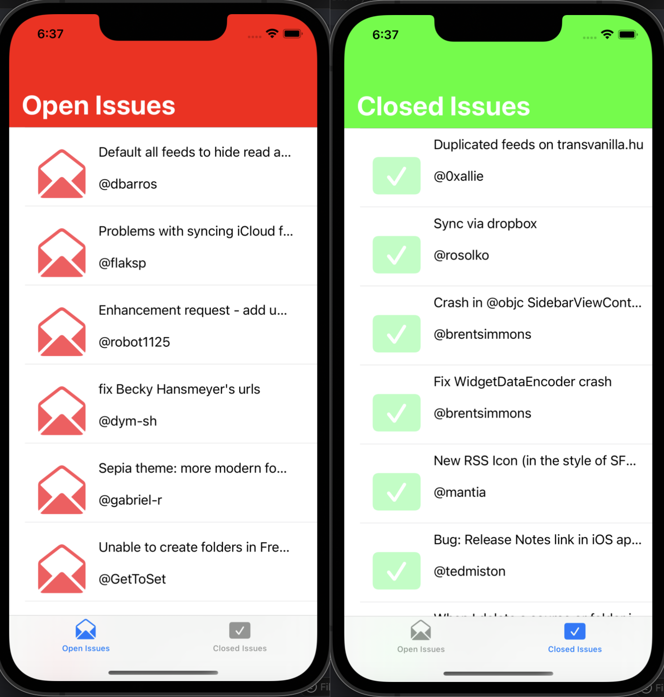

# You've Got Issues!
An app to streamline open/closed GiHub Issues posted in popular open-source repos for simple access built with GitHub REST API to fetch data and Swift’s UIKit for detailed design and implementation

I built this app for my iOS Application Development class! Received the highest score :)
